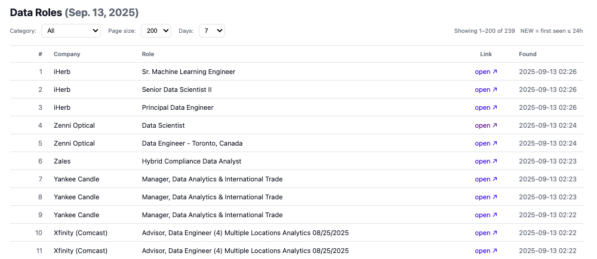
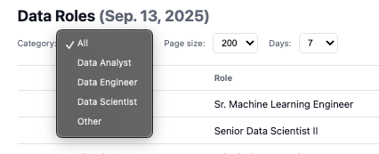
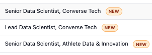

Retail Data-Jobs Scraper

A focused web scraper that collects data roles (Data Scientist / Data Engineer / Data Analyst and variants) from a curated list of retail/consumer brands. The target list is configurable and the pipeline can be extended to any industry or company set.

1 Why this project?

Many company job boards list thousands of roles across stores, warehouses, and corporate functions. This repo focuses the signal by:

Scoping to specific companies you care about (a CSV/DB list).

Whitelisting titles for data/ML/analytics roles only.

Normalizing across common ATS platforms (Workday, Greenhouse, Lever, SAP SuccessFactors, iCIMS, Phenom, Oracle Cloud HCM, SmartRecruiters) with a hardened generic HTML fallback.

De-duplicating and tagging NEW jobs so you can check updates at a glance.

2 Features
🔎 Strict title filter (whitelist)

Only keep roles matching (case-insensitive):

Data Scientist family: data scientist, applied scientist, ml scientist, machine learning scientist, machine learning analyst (folded into DS)

Data Engineer family: data engineer, ml engineer, machine learning engineer

Data Analyst family: data analyst, data analytics, business intelligence, bi analyst

Internships

data scientist intern / data science intern / machine learning analyst → Data Scientist

data analyst intern → Data Analyst

Non-matching roles are dropped, not shown as “Other”.

🧭 Multi-ATS support + auto-detection

Workday / Greenhouse / Lever / SuccessFactors / iCIMS / Phenom / Oracle Cloud HCM / SmartRecruiters

If nothing matches, fall back to a generic-html scraper that scans anchors and keeps only whitelisted titles.

🆕 “NEW” badge

Jobs whose first_seen_at is within the last N hours (configurable via NEW_BADGE_HOURS, default 24–48h) render with a NEW chip in the UI.

Listing sorts newest first: is_new DESC, found_at DESC.

🧹 De-dup + normalized fields

Unified record shape:

title, apply_url, snippet, category, company_name, found_at

⚙️ Configurable & extensible

Maintain your company list in DB or CSV; add/override per-company data_query_url for better accuracy/speed.

Easy to add a new ATS scraper class.

🗓️ Schedule-friendly

Run on demand or via cron (optional: Celery Beat).

4 How it works (pipeline)

Input companies: each company has name, careers_url, optional data_query_url (often a pre-filtered “keyword=data” page), and active flag.

Detect ATS: guess from URL patterns (myworkdayjobs.com, boards.greenhouse.io, jobs.lever.co, successfactors.com, icims.com, smartrecruiters.com, etc.). If ambiguous, perform one light probe.

Build a prioritized queue of scrapers: [detected ATS, secondary guess, probe result, other known ATS..., generic] (dedup + keep order).

Fetch: call each scraper’s fetch(company, session=...). If one returns zero, try the next; successes are merged with URL-level dedup.

Whitelist filter: keep only titles in the strict list above; drop everything else.

Classify: map to Data Scientist / Data Engineer / Data Analyst (interns folded as described).

Persist: update_or_create by (company, apply_url). First time sets first_seen_at; subsequent runs only refresh found_at.

UI: show tabs (All / DS / DE / DA), highlight NEW, order by new first.

5 Tech stack

Python 3.10+

Django 5.x

Requests (+ urllib3 Retry)

BeautifulSoup4 (for some HTML)

SQLite by default (switch DB in config/settings.py if needed)

(Optional) Celery worker/beat

Project layout
config/                 # Django settings & urls
jobs/
  management/commands/
    run_scrape_now.py   # CLI entry (filtering, parallelism, save)
  models.py             # Company / JobHit
  scraper/
    api.py              # orchestrator (session, ATS queue, whitelist, classify)
    keywords.py         # anchor keywords for generic HTML fallback
    workday.py          # + greenhouse.py, lever.py, successfactors.py, icims.py,
    phenom.py           #   oracle.py, smartrecruiters.py
    generic.py
  templates/jobs/
    base.html
    latest.html         # list view with NEW chips and filters

Quickstart
1) Setup
python3 -m venv .venv
source .venv/bin/activate
pip install -r requirements.txt
python manage.py migrate

2) Seed companies

Option A (DB/Admin): add companies via Django Admin (name, careers_url, optional data_query_url, active=1).

Option B (CSV): keep a CSV and import with a small management command (you can add one later).

Tip: data_query_url that directly lists keyword=data often yields better speed and accuracy.

Example CSV (replace with your list):

name,careers_url,data_query_url,active,notes

3) Run a single company (debug)
# Try just Wayfair
python manage.py run_scrape_now --company "Wayfair" --limit 1 --parallel 1 -v 0

4) Full crawl
# Active companies only; parallel 4; generous cap
python manage.py run_scrape_now --only-active --parallel 4 --limit 10000 -v 0

5) Start the web UI
python manage.py runserver 8001
# Open http://127.0.0.1:8001/jobs/

Environment variables

| Var                | Default | Meaning                                                                  |
| ------------------ | ------- | ------------------------------------------------------------------------ |
| `VERBOSE`          | `0`     | `1` to print debug lines from scrapers/orchestrator; keep `0` for speed. |
| `HTTP_TIMEOUT`     | `15`    | Request timeout (seconds).                                               |
| `HTTP_POOL`        | `64`    | Requests connection pool size.                                           |
| `HTTP_BACKOFF`     | `0.3`   | Retry backoff factor.                                                    |
| `GENERIC_MAX_HITS` | `300`   | Cap for generic HTML fallback hits per page.                             |
| `WD_US_ONLY`       | `1`     | Workday filter hint: focus on US if possible.                            |
| `NEW_BADGE_HOURS`  | `48`    | Time window for showing the **NEW** badge.                               |

Add this line (run every day at 20:00):

0 20 * * * cd /path/to/retail-ds-scraper && /path/to/retail-ds-scraper/.venv/bin/python manage.py run_scrape_now --only-active --parallel 2 --limit 10000 >> logs/scrape.log 2>&1

(Optional) Celery
# Terminal 1: Worker (solo pool helps avoid SQLite locks locally)
.venv/bin/celery -A config worker -l info --pool=solo

# Terminal 2: Beat (scheduler)
.venv/bin/celery -A config beat -l info

# Or single process
.venv/bin/celery -A config worker -B -l info --pool=solo

Performance & quality tips

It’s slow: lower --parallel (avoid throttling), ensure VERBOSE=0, and prefer accurate data_query_url per company.

You get a search entry page instead of a job detail: use a dedicated ATS scraper where possible; otherwise refine data_query_url or strengthen the site-specific scraper.

SQLite “database is locked”: run single process; with Celery use --pool=solo; for servers, consider PostgreSQL/MySQL.

Still seeing irrelevant jobs: the whitelist is strict—if you see leakage, it likely came from a non-ATS HTML page; tighten generic.py keyword cues or add a site-specific scraper.

Extending

Add companies / industries: append to your DB/CSV; this pipeline is company-first and industry-agnostic.

Add a new ATS: create jobs/scraper/<newats>.py with a fetch() that returns normalized records; register it in scraper/api.py’s orchestrator; optionally add handles() for fast routing.

Fine-tune the generic HTML fallback: adjust jobs/scraper/keywords.py and the filters in generic.py.

FAQ

Q: Why 0 results for some companies?
A: They may currently have no whitelisted roles, be rate-limiting, or use an unsupported pattern. Test with --company, verify data_query_url, and try again.

Q: Where is the NEW badge?
A: It appears when first_seen_at is within NEW_BADGE_HOURS. Also make sure the page sorts by is_new desc, found_at desc (the provided template does).

Q: Can I use this outside retail?
A: Yes. The approach is “company list + ATS adapters + strict title whitelist”. Swap the company list to any domain.
